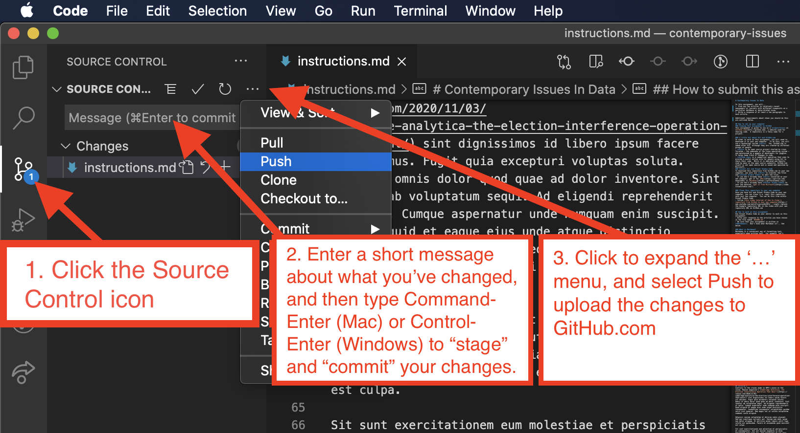

# Contemporary Issues In Data

In this assignment, you will...
1. Find any two articles in relatively recent newspapers or journals with different viewpoints on a particular database or data-related issue.
1. Write a response of at least a two paragraphs to each article.

Additional requirements about *how* you should do this are outlined below.

## How to set up your computer 
### Viewing this assignment on GitHub
This assignment is given to you as a **repository** on [GitHub.com](htts://github.com), a website used for sharing code.  A repository is a fancy name for a project.

### A little bit about Git and GitHub.com
In order to work on this assignment, you will need to download it to your own computer.  To do this, you will use a technology called **Git**.  Yes, GitHub.com is named after Git, although they are created by different groups of people. 
- **Git** is an open source project started by Linus Torvalds - the namesake of the Linux operating system - and maintained by a gaggle of developers for giggles.  It helps keep track of changes to code.
- **GitHub.com** is a commercial operation that aims to provide a useful online site for people using Git to share their code.  While it is embraced and heavily used by many in the open source community, GitHub.com itself is not open source and is owned and operated by Microsoft.
### Install Git and Visual Studio Code
To download this repository from GitHub.com to your own computer, you will use **Git** to transfer the files and **Visual Studio Code** to edit the files.
- If you don't already have **Git** installed on your own computer, get it for [Mac](https://git-scm.com/downloads) or [Windows](https://gitforwindows.org/).
- If you don't already have **Visual Studio Code** on your own machine, [get it from Microsoft](https://code.visualstudio.com/).

### Clone this repository to your own computer
Once you have Git and Visual Studio Code on your own computer, you can clone (i.e. copy) this repository onto your own computer.  You can do this from within Visual Studio Code.
- follow [this video tutorial of how to clone a repository from GitHub to your own computer](https://www.youtube.com/watch?v=axcny0o1NYo) - simply replace the example repository URL in the video with your own repository URL on GitHub.com

## How to work on this assignment
Use Visual Studio Code as your editor to work on this assignment.
- Write your response to the articles you have chosen in the file named `README.md` - delete the current contents of that file when you start.
- Be sure that your assignment is written in **Markdown**.  Don't know what Markdown is?... See below.

### What is Markdown?
Markdown is a convenient way of formatting text, especially when writing text.  For example, let's hypothetically say you wanted to write a document about two contemporary issues in data.  Let's further imagine that you wanted to include the following in your document:
- the title of the document
- some intro text describing the purpose of the document
- two subheadings - one for each contemporary issue discussed in the document
- a link to an article about each contemporary issue
- at least two paragraphs of body text containing your personal response to each articles you linked to.

Markdown allows you to write all this in a way that can be easily formatted by writing simple codes within the document text itself, rather than using buttons or shortcuts in a proprietary program like Microsoft Word, Google Docs, Apple Pages, or the like.

Try a [Markdown tutorial](https://www.markdowntutorial.com/).  This document is written in Markdown - view it in Visual Studio Code to see how it is written.  View it on GitHub to see how it renders on the web.

### How to format your assignment text
You may have guessed it... we want you to include all the components listed above so the document is nicely-formatted when viewed on GitHub:
- the title of the document - use the `# ` code in Markdown to indicate the title
- some intro text describing the purpose of the document - put line breaks before and after any text ot create a paragraph in Markdown
- two subheadings - one for each contemporary issue discussed in the document - use the `## ` code to indicate subheadings in Markdown
- a link to an article about each contemporary issue - put these below each subheading using a code such as `[The link text you see on the web page](https://the.website.you.want.it.to.link.to)` to indicate a link in Markdown
- at least two paragraphs of body text containing your personal response to each articles you linked to - put these below each subheading.

For example, an assignment text, in the file named README.md, written in Markdown might look something like this (ignore the placeholder text):
```markdown
# Cambridge Analytica's Use of Facebook Users' Data to Influence the 2016 Presidential Election
In this document, I discuss two articles about Cambridge Analytica's mining of Facebook data and the claims made by some that it altered the course of the 2016 US Presidential Election.  I present and discuss two opposing views on this important matter.

## Article 1
In NPR's [What Did Cambridge Analytica Do During The 2016 Election?](https://www.npr.org/2018/03/20/595338116/what-did-cambridge-analytica-do-during-the-2016-election), est et vitae rem excepturi voluptatem reprehenderit. At deserunt necessitatibus natus minus dignissimos qui adipisci. Sapiente incidunt vero deserunt sunt nam. Reiciendis laborum. Ea ab omnis porro nihil. Corrupti similique dignissimos dignissimos soluta dolor. Facere vel repudiandae qui non velit.

Vero nesciunt culpa natus est veniam qui. Debitis est ut mollitia sit assumenda vel atque voluptas. Officiis fugit veniam enim. A quisquam omnis commodi nemo officiis aspernatur recusandae. Rerum aut placeat nesciunt placeat deleniti. Fugiat cumque dolores sequi et iste deleniti perferendis. Vitae et maxime aperiam est molestias id. Eligendi et sint quibusdam et excepturi. Totam facilis eius est.

## Article 2
Contrary to the claims made in NPR's piece on the issue, Reason magazine's [Cambridge Analytica, the Election Interference Operation That Wasn't](https://reason.com/2020/11/03/cambridge-analytica-the-election-interference-operation-that-wasnt/) sint dignissimos id libero ipsum facere sit ducimus. Fugit quia excepturi voluptas soluta. Nobis ut omnis dolor quod quae ad dolor inventore. Sint tenetur ab voluptatum sequi. Ad eligendi reprehenderit ut optio. Cumque aspernatur unde numquam enim suscipit. Quod aliquid et eaque eius unde atque distinctio consequatur. Laudantium consequatur voluptatibus quidem velit sint quaerat. Rem magni vel ut soluta voluptatum commodi iusto aliquid.

Adipisci veniam voluptatem et dolorum nobis placeat. Sed qui similique corrupti aut. Veniam eum modi ipsam non dolor aliquam. Ut mollitia animi labore velit fuga soluta est quibusdam. Facere et assumenda quod nesciunt est culpa.

Sit sunt exercitationem eum molestiae et perspiciatis et consequuntur. Aut aut maxime expedita in enim. Voluptatem quos sunt qui. Sed cupiditate et sit vero eum aspernatur ipsa porro.
```

## How to submit this assignment
Once you have written your assignment, formatted it nicely in Markdown, and saved it into the file named `README.md`, you are ready to submit it.  Do this from within Visual Studio Code.
1. Click on the `Source Control` icon in the left side bar in Visual Studio Code.
1. In the Source Control panel, you will see a field named `Message` - type in a unique message about what you have done, e.g. "*Finished assignment!*" or whatever you want to write as a short note to yourself.
1. Hover over the words `Source Control`. You will see a `...` icon appear - click it to see a menu.  In that menu, click `Commit`->`Commit`.  This logs the changes you've made to the Git project - remember Git is used to keep track of changes.
1. Go to the same menu and click `Push` to submit your assignment - this uploads your updated files to the copy of your respository on GitHub.



That's it... you're done.

## Double-check your submission
Prove to yourself that you have correctly submitted by viewing your repository on the GitHub website - you should see your completed README.md file there.

## Resubmit as many times as you want
You can re-submit as many times as you want before the deadline.  Just make changes to the files on your own computer and repeat the process outlined above to upload them to GitHub.
